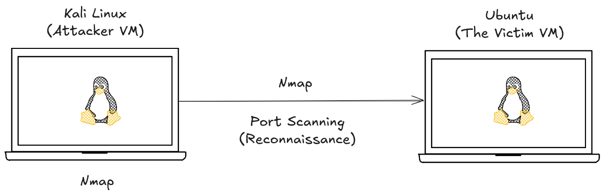

# Port Scanning Simulation and Log Analysis

Port scanning is a reconnaissance technique used by attackers to identify open ports and services running on a target system. Each open port represents a potential entry point into the system.

Ports are logical communication endpoints. For example:

* HTTP - Port 80
* HTTPS - Port 443
* SSH - Port 22

Attackers scan these ports to understand what services are exposed and potentially vulnerable.

## Working Mechanism :

Port scanning works by sending packets to a target system and analyzing the responses to determine the state of ports.

### Common Port States:

* **Open** - Service is actively accepting connections
* **Closed** - No service is running, but system is reachable
* **Filtered** - Firewall or security rules are blocking the scan

### Types of Scans:

* **TCP Connect Scan** - Completes full handshake
* **SYN Scan (Half-open)** - Does not complete full handshake (stealthier)
* **UDP Scan** - Checks UDP services (slower and less reliable)

## Attack Methodology



1. Identified the target IP address
   Using the command - `ip a`

2. Verified active services on the target system
   `ss -tulnp`

3. From Kali Linux, initiated a port scan using Nmap

```bash
nmap -sS -p- <UBUNTU_IP>
```

### Command Breakdown:

* `nmap` - Network scanning tool
* `-sS` - SYN scan (stealth scan)
* `-p-` - Scan all 65535 ports
* `<UBUNTU_IP>` - Target system IP

4. The scan sends packets to multiple ports on the target system

5. Based on responses, Nmap identifies:

   * Open ports
   * Closed ports
   * Filtered ports


## What Happens Internally

* The attacker system sends crafted packets to different ports
* The target system responds based on port state
* Open ports reply positively (SYN-ACK)
* Closed ports respond with RST packets
* Filtered ports may not respond at all

Unlike brute force attacks, this activity is quieter and does not always generate obvious logs.

## Log Analysis

Port scanning does **not always generate direct logs** like authentication attacks.

### Observations:

* No clear entries in `/var/log/auth.log`
* Minimal or no logs in default system logs
* Network activity increases during scan

* Port scanning operates at the network level
* Many systems do not log every incoming connection attempt by default
* Detection usually requires firewall logs or IDS tools

## Learned 

* High number of connection attempts across multiple ports
* Short time interval between requests
* Sequential or random port access patterns
* Network traffic anomalies

### Tools commonly used:

* Firewall logs (iptables, ufw)
* Intrusion Detection Systems (IDS)
* SIEM tools for correlation

## Mitigation :

* **Firewall Configuration:** Use `ufw` or `iptables` to restrict unnecessary ports
* **Close Unused Ports:** Disable services that are not required
* **Rate Limiting:** Limit incoming connection attempts
* **Intrusion Detection Systems:** Deploy tools to detect scanning behavior
* **Port Knocking (Advanced):** Hide services behind authentication sequence

Port scanning is often the **first step in an attack lifecycle**. While it may not always leave obvious logs, it plays a crucial role in identifying attack surfaces. Detecting it requires a shift from log-based monitoring to network behavior analysis.

